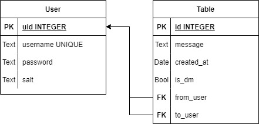

# Database Architecture

The database I went for is something light and simple like sqlite3. Everything is 
saved and populated on the fly into sqlite3.

## Databse Diagram

Here is a diagram of the way the database is setup



## Helpful Scripts

Check if a user exists:
```sql
SELECT EXISTS(SELECT 1 FROM user WHERE username == "user1" LIMIT 1)
```

Get the UID of a user:

```sql
SELECT uid FROM user WHERE username == "user1" LIMIT 1;
```

Select the last 10 public message sent in ascending order, with the last sent message last:

```sql
SELECT username, message, created_at FROM (
	SELECT * FROM message LEFT JOIN user
	WHERE message.from_user == user.uid
	AND message.is_dm == 1
	ORDER BY id
	DESC LIMIT 15
) ORDER BY id ASC
```

Select the last 10 DM messages between two different users in ascending order, with the last sent message last:

This example uses uses 1 and 4 as an example.
```sql
SELECT message, created_at, "from", "to" FROM (
	SELECT
	message.id, message, created_at,
	user_from.username AS "from", user_to.username as "to"
	FROM message
	LEFT JOIN user user_from
	ON message.from_user == user_from.uid
	LEFT JOIN user user_to
	ON message.to_user == user_to.uid
	WHERE message.is_dm == 0
	AND (message.from_user == 1 OR message.from_user == 4)
	AND (message.to_user == 1 OR message.to_user == 4)
	ORDER BY message.id DESC
	LIMIT 15
) ORDER BY id ASC
```