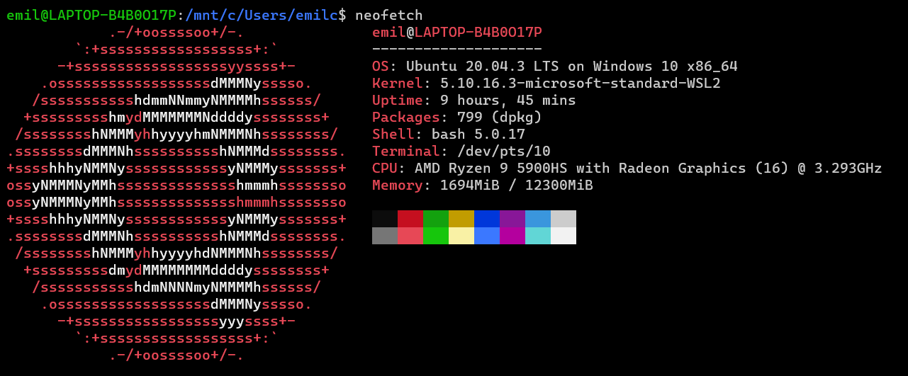
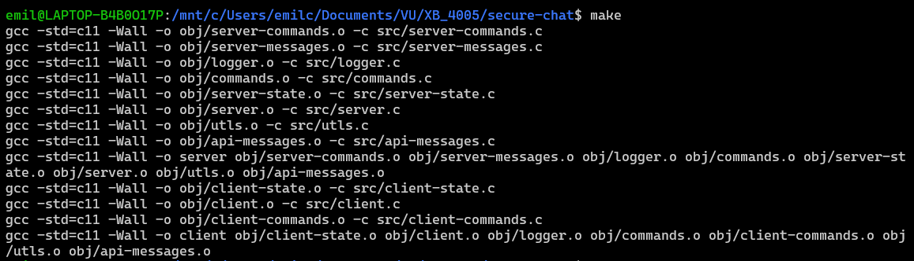
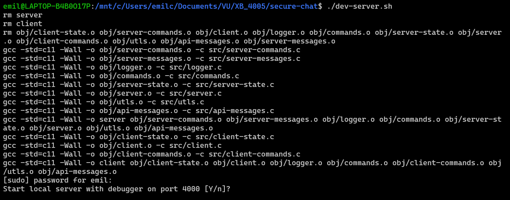

# C Chat App

This is a socket app built all in C that allows you to connect between multiple users and send messages live to each other.

# How to Build

Firstly you need to generate some keys. Run the "pems" command in make by doing `make pems` to generate a certificate and a key

To build this project, in your linux terminal, run `make`. This has been developed to work on Ubuntu 20.04.3 LTS



In the root directory run `make` to build.



# How to Run

## Run Executables Directly

Once you have it build you must first run the server executable by doing. `debug mode` is always active on the server

```bash
./server 4000
```

To run the client do:

```bash
./client localhost 4000
```

## Running Server for Development

An all in one build script is added to this project that will build both client and server executables, and allow you to run immediately. 

To use this script, run this in the terminal

```bash
./dev-server.sh
```

It should look like so:



Select `Y` will autostart the server on port 4000

## Usage Help

You can always run the `/help` command to see the list of all possible commands.

Here is a print of the `/help` command:

```
 /login - Logs you into an existing account with this app
             USAGE: /login [username] [password]
 /logout - Logs you out of an account currently in session
             USAGE: /logout
 /register - Register a new account with a unique username
             USAGE: /register [username] [password]
 /users - Display all online users
             USAGE: /users
 /history - Get the history of the global channel (up to 30 messages)
             USAGE: /history [message count]
 /pmhistory - Get your private message history from a user
             USAGE: /pmhistory [user you messaged] [message count]
 /help - Help command
             USAGE: /help
 /exit - Exit the chat and close the program
             USAGE: /exit
```

# More Information

The `docs/` folder that is included in this repository contains architectural information about the project. Here are links to each piece of documentation

[Networking Architecture](./docs/architecture/networking.md)

[Security](./docs/architecture/security.md)

[Database](./docs/architecture/database.md)

[Extending The Code](./docs/architecture/continued-development.md)